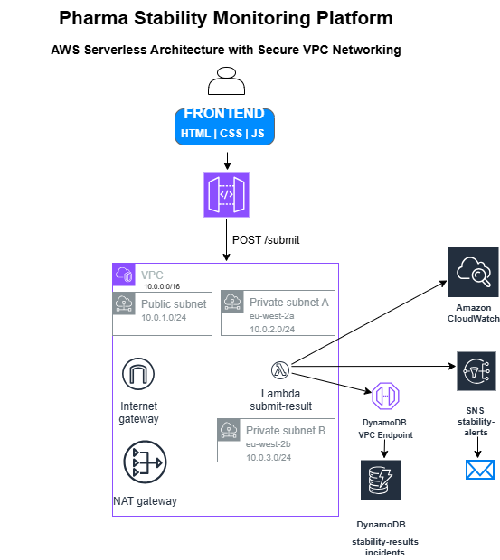
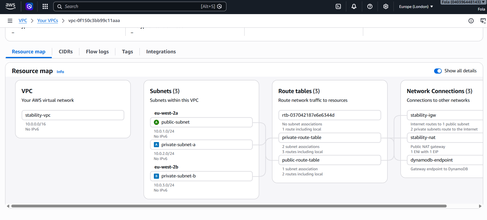
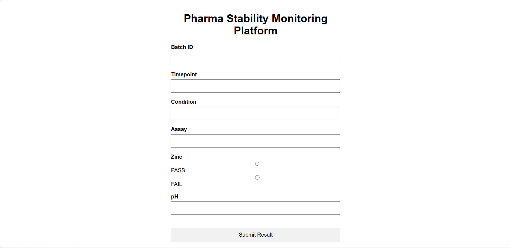
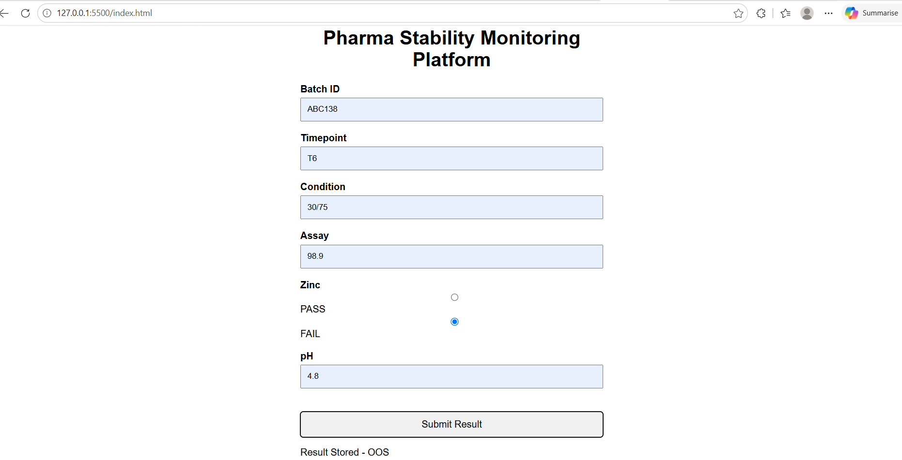
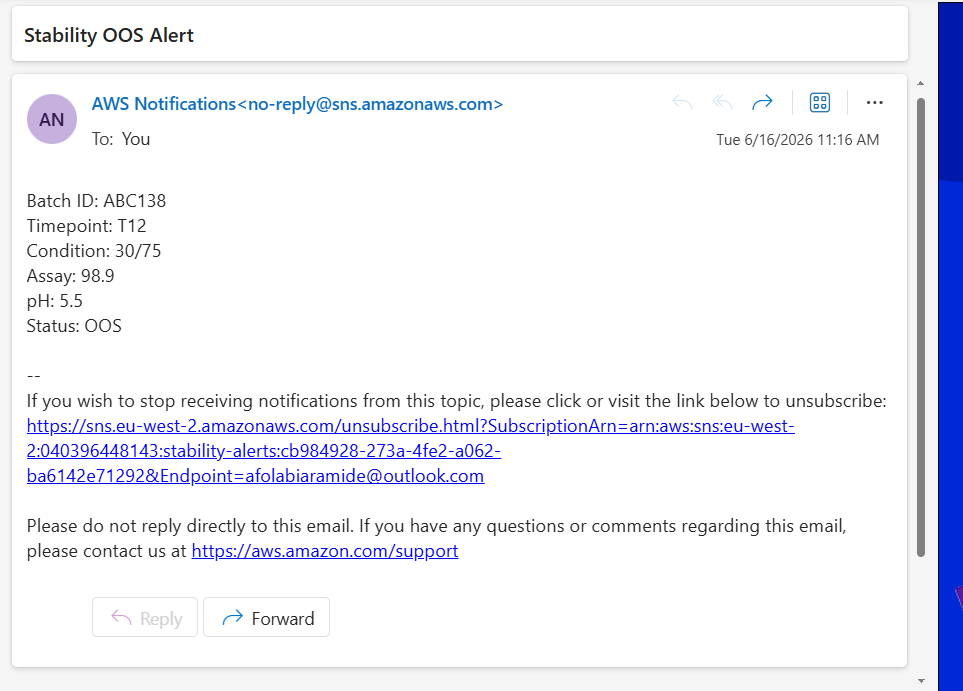
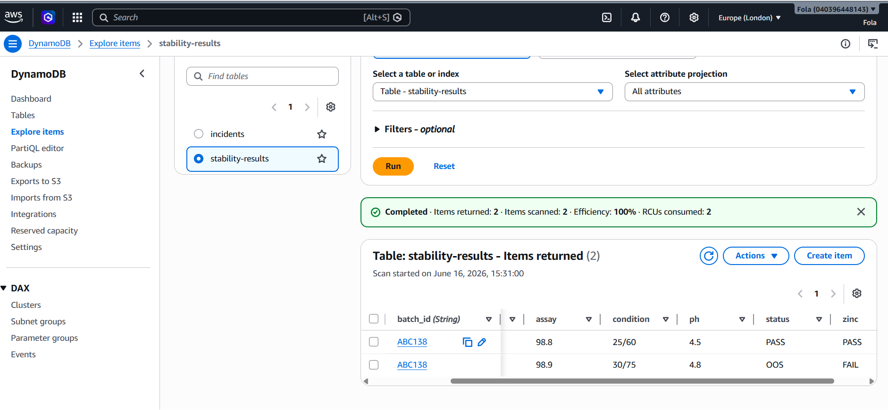
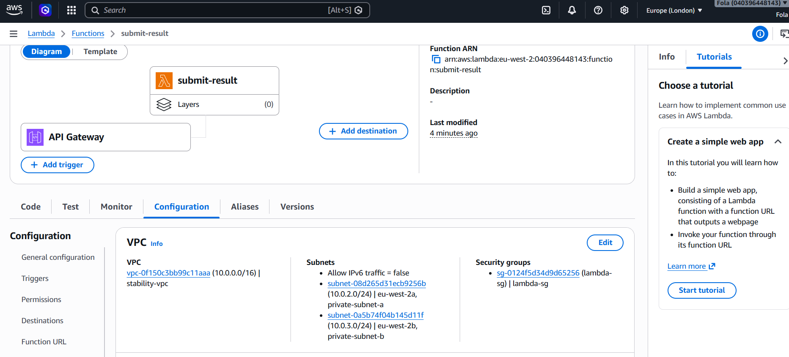
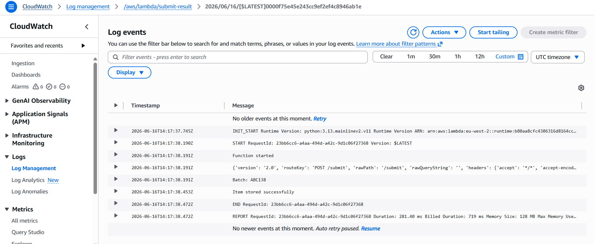
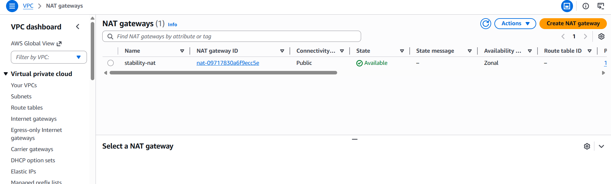
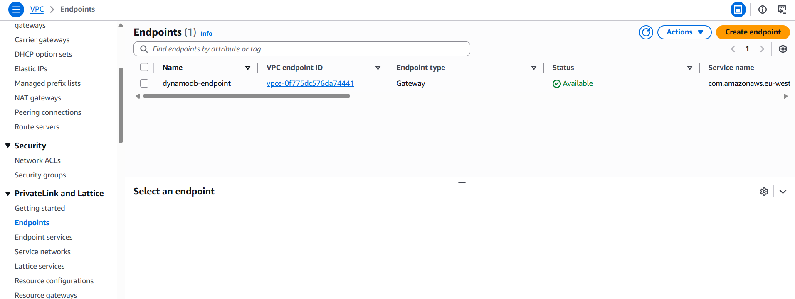

---

# Pharma Stability Monitoring Platform

A full-stack AWS cloud application that automates pharmaceutical stability result submission, Out-of-Specification (OOS) detection and email alerting using a secure, Terraform-managed infrastructure.

## Business Problem

Pharmaceutical stability studies generate thousands of analytical results across multiple batches, storage conditions, and timepoints.

In many laboratories, results are:

* Entered manually into spreadsheets
* Monitored through email chains
* Difficult to audit and track
* Slow to escalate when Out-of-Specification (OOS) results occur

Delayed identification of OOS results can lead to:

* Product release delays
* Increased investigation costs
* Regulatory compliance risks
* Reduced operational efficiency

This project demonstrates how a cloud-native platform can automate result capture, detect OOS events in real time and notify stakeholders immediately.

---

## Solution

This platform provides:

* Web interface for stability result submission
* REST API using AWS API Gateway
* Serverless business logic using AWS Lambda and Python
* Automatic OOS detection
* Real-time email notifications using Amazon SNS
* Persistent storage using DynamoDB
* Monitoring using CloudWatch
* Secure VPC networking with private subnets and DynamoDB VPC Endpoint
* Infrastructure fully provisioned using Terraform

---

## Key Features

### Stability Result Submission

Users submit:

* Batch ID
* Timepoint
* Storage Condition
* Assay Result
* Zinc Status
* pH

through a browser-based interface.

---

### Automated OOS Detection

Business logic automatically evaluates:

```text
If Zinc = FAIL

↓

Status = OOS

↓

Trigger Alert
```

This reduces manual monitoring and ensures rapid escalation.

---

### Real-Time Email Notifications

When an OOS result is detected:

* AWS Lambda publishes to SNS
* SNS sends email alerts instantly
* Relevant batch and analytical data are included

Example:

```text
Batch ID: ABC134
Timepoint: T6
Condition: 25/60
Assay: 98
pH: 5.6
Status: OOS
```

---

### Secure Serverless Architecture

The application uses:

* Private subnets across multiple Availability Zones
* Security Groups
* NAT Gateway
* DynamoDB VPC Endpoint

This ensures:

* No public access to Lambda
* Private connectivity to DynamoDB
* High availability
* Reduced attack surface

---

## Architecture


### Networking:


## AWS Services Used

| Service           | Purpose                                 |
| ----------------- | --------------------------------------- |
| API Gateway       | REST API endpoint                       |
| Lambda            | Serverless backend                      |
| DynamoDB          | NoSQL data storage                      |
| SNS               | Email notifications                     |
| CloudWatch        | Logging and monitoring                  |
| VPC               | Network isolation                       |
| Internet Gateway  | Internet access                         |
| NAT Gateway       | Outbound internet for private resources |
| Security Groups   | Firewall rules                          |
| DynamoDB Endpoint | Private AWS service access              |
| IAM               | Access control                          |
| Terraform         | Infrastructure as Code                  |

---

## Terraform Infrastructure

All infrastructure is provisioned using Terraform.

Resources include:

* VPC
* Public subnet
* Two private subnets
* Internet Gateway
* NAT Gateway
* Route tables
* Security Groups
* DynamoDB tables
* Lambda function
* API Gateway
* SNS Topic and Subscription
* DynamoDB Gateway Endpoint

Infrastructure can be:

```bash
terraform apply
```

and destroyed using:

```bash
terraform destroy
```

allowing complete environment recreation from code.

---

## Monitoring

CloudWatch logs provide visibility into:

* API requests
* Lambda execution
* DynamoDB writes
* SNS publishing
* Application troubleshooting

Example logs:

```text
Function started

SNS notification sent

Item stored successfully
```

---

## Results

This project demonstrates:

✅ Full-stack cloud application development

✅ Infrastructure as Code using Terraform

✅ Serverless architecture design

✅ Secure VPC networking

✅ API development

✅ Automated alerting workflows

✅ Monitoring and troubleshooting

✅ High availability architecture

---

## Future Improvements

Potential enhancements include:

* Incident management workflow
* Incident dashboard
* Authentication using Cognito
* CI/CD using GitHub Actions
* Docker containerisation
* Kubernetes deployment
* CloudWatch dashboards
* Multi-environment Terraform configuration
* Automated testing

---

## Screenshots

* 
* 
* 
* 
* 
* 
* 
* 

---

## Author

**Afolabi Aramide**

Cloud & DevOps Engineer | AWS | Terraform | Python | Serverless Architecture

---
